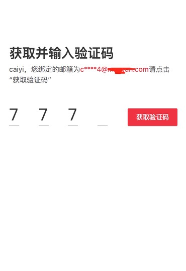

# 获取4位验证码


手写了一个四位验证码功能，及其中的优化  


首先是功能的实现

```
// 显示的4位验证码
<div className="simple-input-content">
    <span>{verifCode.slice(0, 1)}</span>
    <span>{verifCode.slice(1, 2)}</span>
    <span>{verifCode.slice(2, 3)}</span>
    <span>{verifCode.slice(3, 4)}</span>
</div>

// 被隐藏的真实input
<Input
size="large"
maxLength={4}
className="verification-input4"
/>

// 样式：

.simple-input-content {
    text-align: left;
    position: fixed;
    top: 161.5px;
    label {
        padding: 20px;
    }
    span {
        vertical-align: middle;
        display: inline-block;
        height: 46px;
        width: 20px;
        line-height: 46px;
        margin-right: 38.5px;
        font-family: PingFangSC-Regular;
        font-size: 33px;
        color: #333333;
        text-align: left;
        border-bottom: 1px solid rgba(0, 0, 0, 0.3);
    }
}

.verification-input4 {
    opacity: 0;
    left: 0;
}


```


这个实现难度并不高，其实很多问题出在了`获取验证码`那，然后有了下面的优化过程。（涉及逻辑代码不贴出来） 

简单总结一下

1. 首先是开始的逻辑是发送短信成功后再改变计时的状态,--修改点击按钮disabled。
2. 然后用到的地方很多，--封装了setInterval方法。
3. 在短时间有点击2次的风险，导致计时可以为负数，emmmm,--添加了防抖。
4. 计时count--， 61s倒计时，--修改为 --count。
5. 等等。

防抖会限制用户什么时候能够点击`获取验证码`,以及timer、count的状态需要更多的处理。

看看效果图：




