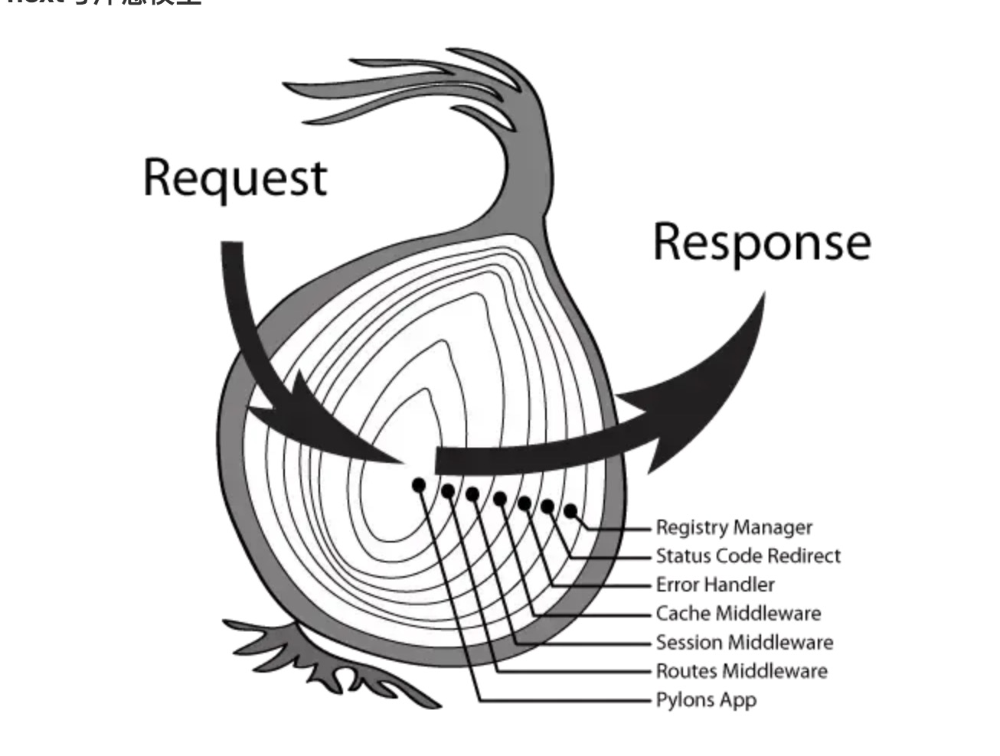

# koa的req和request对象

## 问题
koa接受不到post的数据 ,ctx.request.body为空  

post请求，ctx.request里面没有body参数。

解决： 
使用 koa-body 插件。  
koa-body中间件可以把koa2上下文的formData数据解析到ctx.request.body中。  

1. get请求：使用 ctx.query
2. post请求：使用ctx.request.body


## ctx.req与ctx.request

```

ctx.request:是Koa2中的Context经过封装的请求对象，它用起来更直观和简单。
ctx.req（原生）:是content提供的node.js原生HTTP请求对象。

```


## 中间件--洋葱模型

```
app.use(async (ctx,next)=>{
  console.log(1);
  await next();
  console.log(2);
});

app.use(async (ctx,next)=>{
  console.log(3);
  await next();
  console.log(4);
});

<<<
1
3
4
2


```


```
compose(ctx,middlewares){
    function dispatch(index){
    	let middleware = middlewares[index];
        if(middlewares.length === index)return Promise.resolve();
        return Promise.resolve(middleware(ctx,()=>dispatch(index+1)));
    }
    return dispatch(0);
}

```

每一个async fn都是一个promise，
在上面的代码中我们让这个promise转换为成功态后才会去遍历下一个middleware，而什么时候promise才会转为成功态呢？
嗯，只有当一个async fn执行完毕后，async fn这个promise才会转为成功态，而每一个async fn在内部若存在异步函数的话又可以使用await，
SO，我们就这样将各个middleware串联了起来，即使其内部存在异步代码，也会按照洋葱模型执行。





